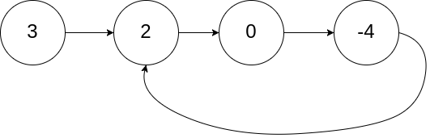

# LinkedList Based Questions

## 1. [Linked List Cycle](https://leetcode.com/problems/linked-list-cycle/description/)

### Problem

- Given `head`, the head of a linked list, determine if the linked list has a cycle in it. There is a cycle in a linked list if there is some node in the list that can be reached again by continuously following the next pointer.

- Example 1



```
Input: head = [3,2,0,-4]
Output: true
Explanation: There is a cycle in the linked list, where the tail connects to the 1st node (0-indexed).
```

- Example 2


```
Input: head = [1,2]
Output: true
Explanation: There is a cycle in the linked list, where the tail connects to the 0th node.
```

### Constraints

- The number of the nodes in the list is in the range [0, 10<sup>4</sup>].
- -10<sup>5</sup> <= Node.val <= 10<sup>5</sup>

### Solution

#### 1. Replacing Node Values

- In this solution, we will be replacing node value by an infinity value, higher+1(10<sup>5</sup>+1) or lower-1 (-10<sup>5</sup>-1) value. While iterating over each node, we will be replacing the node value by one of above values, if the `LinkedList` is cyclic we may encounter with the replaced value.
- Python

```
# Definition for singly-linked list.
# class ListNode(object):
#     def __init__(self, x):
#         self.val = x
#         self.next = None

class Solution:
    def hasCycle(self, head: Optional[ListNode]) -> bool:
        while(head):
            if(head.val==10**5+1):
                return True
            head.val=10**5+1
            head=head.next
        return False
```

- Java

```
/**
 * Definition for singly-linked list.
 * class ListNode {
 *     int val;
 *     ListNode next;
 *     ListNode(int x) {
 *         val = x;
 *         next = null;
 *     }
 * }
 */
public class Solution {
    public boolean hasCycle(ListNode head) {
        if(head==null){
            return false;
        }
        while(head.next!=null){
            if(head.val==(Math.pow(10, 5)+1)){
                return true;
            }
            head.val=(int)Math.pow(10,5)+1;
            head=head.next;
        }
        return false;
    }
}
```

#### 2. Tortoise and Hare algorithm (Two Pointer)

- Here, basically consider two pointer, one moves at a slowest pace (tortoise) and one moves at a fastest pace (hare). So in a circular track, when tortoise and hare starts their race, they gonna get align at one point of time.

<video controls src="/2024-1.mp4" title="title"> </video>

- Same concepts works to find out whether a linked list is cyclic or not. We will be having two pointers, the slowest pointer will iterate node by node, and the faster pointer will jump to alternates nodes. Thus when the fastest and the slowest pointer points the same node, we conclude the linked list is circular.
- Python

```
# Definition for singly-linked list.
# class ListNode(object):
#     def __init__(self, x):
#         self.val = x
#         self.next = None

class Solution:
    def hasCycle(self, head: Optional[ListNode]) -> bool:
        slow, fast = head, head
        
        while fast and fast.next:
            slow = slow.next
            fast = fast.next.next
            if slow == fast:
                return True

        return False
```

- Java

```
/**
 * Definition for singly-linked list.
 * class ListNode {
 *     int val;
 *     ListNode next;
 *     ListNode(int x) {
 *         val = x;
 *         next = null;
 *     }
 * }
 */
public class Solution {
    public boolean hasCycle(ListNode head) {
    if (head == null || head.next == null) {
            return false;
        } 
        ListNode fastest = head.next;
        ListNode slowest = head;
        while (fastest != null) {
            if (fastest == slowest) {
                return true;
            }
            if (fastest.next == null) {
                return false;
            }
            fastest = fastest.next.next;
            slowest = slowest.next;
        }
        return false;
    }
}
```